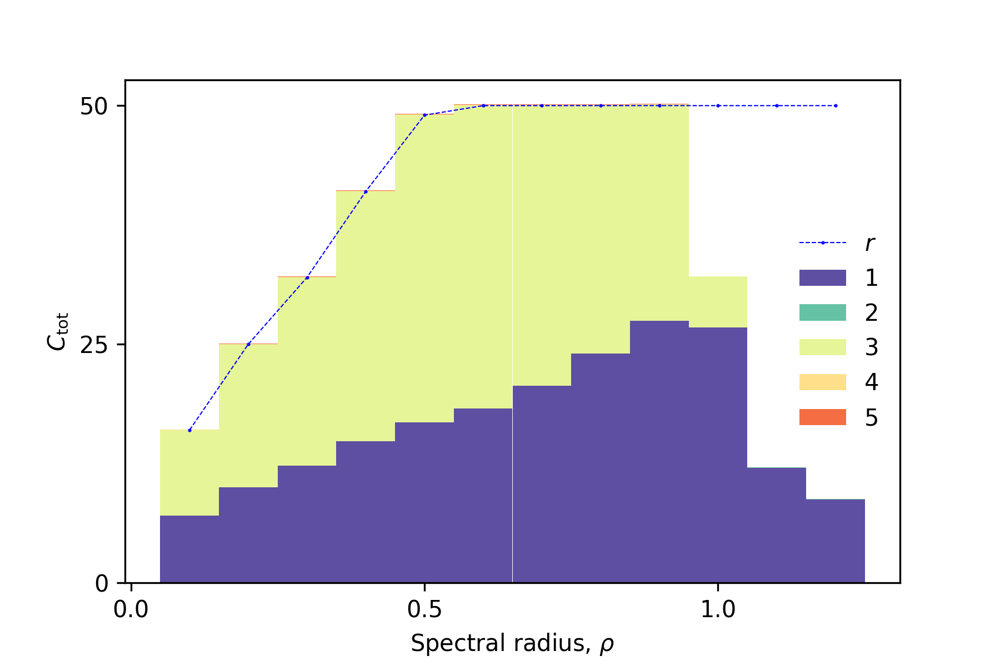
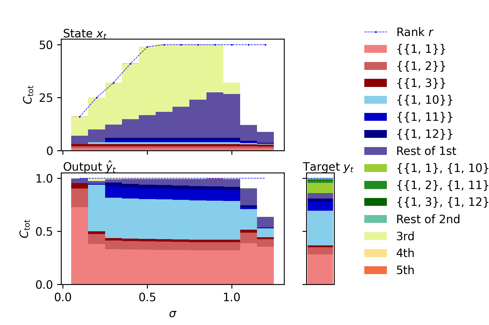

# Information Processing Capacity
The information processing capacity (IPC) [1,2] is a measure to comprehensively examine computational capabilities of a dynamial system that receives random input 

. 
The system state 


holds the past processed inputs 

 (e.g.,

). 
We emulate the processed inputs 

 with linear regression of the state as follows: 


Subsequently, we quantify the IPC as the amount of the held input using the following emulation accuracy: 


 

Under the assumption that the state is a function of only input history 

, the total capacity 

, which is the summation of IPCs over all types of 

, is equivalent to the rank of correlation matrix 

 (see [1,2] for further details). 


# Environment
The scripts use a GPU to compute IPCs fast and adopt CuPy library for multiprocessing. 
Please install required libraries through the following procedure. 
1. Check your CUDA version by 
    ```
    /usr/local/cuda/bin/nvcc --version
    ```
2. Check your CuPy version 
<a href="https://docs.cupy.dev/en/stable/install.html#installing-cupy" target="_blank" rel="noopener noreferrer">here</a>

3. Install the libraries by 
    ```
    pip install jupyter numpy matplotlib pandas cupy-cudaXXX
    ```

### Google Colaboratory
If you do not have available GPU(s), you can use [Google Colaboratory](https://colab.research.google.com/?utm_source=scs-index), 
which provides a free GPU with 12 GB memory (as of Jun 7th, 2022). 
Here is the [sample code](https://colab.research.google.com/drive/13gzqOcnnejuJYh6yAPlX2bksWFQSFzNP?usp=sharing) of `sample1_esn.ipynb` on Google Colaboratory. 
Note that, if 12-hour time limit is over or it is not used for 90 minutes, it will shut down and erase your data. 

# Example Codes
1. Echo state network (ESN)

    First, we demonstrate IPCs of an ESN to explain basic usage of the library. 
    Please read `sample1_esn.ipynb` for details. 
    After running it, we get the following IPC decomposion, which summarizes capacities for each order of input. 
    The total capacity 
    
    
    is equaivalent to the rank 
    
     in the ordered region 
    (the spectral radius 
    ). 

    
    
2. Input distribution

    The input for IPC must be random but you can use an arbitrary type of input distribution other than uniform random input [2]. 
    `sample2_dist.ipynb` explains how to use seven other basic distributions. 
    Even if your input distribution is not included in the eight ones, you can compute IPCs using arbitrary polynomial chaos (aPC) [2]. 
    `sample2_dist.ipynb` also provides how to use aPC using a complex distribution such as a mixed Gaussian one. 

3. Individual IPC

    When we would like to focus on not IPC summarized for each order but individual IPCs, we can easily compute and plot the individual ones. 
    For example, the following figure illustrates the individual IPCs of the NARMA10 benchmark task model, ESN state, and output of NARMA10-trained ESN. 
    `sample3_individual.ipynb` provides an example code to plot them. 

    


    

If you compute IPCs of your reservoir, please replace input, state, and a set of degrees and delays with yours. 

# Release notes
- version 0.10: 
A version for single input. 
You can compute IPCs using arbitrary input distribution except for bernoulli one. 
- version 0.11: 
We added `sample3_individual.ipynb` and information on Google Colaboratory. 
Also, we modified a bug in `single_input_ipc.get_indivators()`. 

# References 
[1] Joni Dambre, David Verstraeten, Benjamin Schrauwen, and Serge Massar. ''[Information processing capacity of dynamical systems.](https://www.nature.com/articles/srep00514)'' Scientific reports 2.1 (2012): 1-7.

[2] Tomoyuki Kubota, Hirokazu Takahashi, and Kohei Nakajima. ''[Unifying framework for information processing in stochastically driven dynamical systems.](https://journals.aps.org/prresearch/abstract/10.1103/PhysRevResearch.3.043135)'' Physical Review Research 3.4 (2021): 043135.
